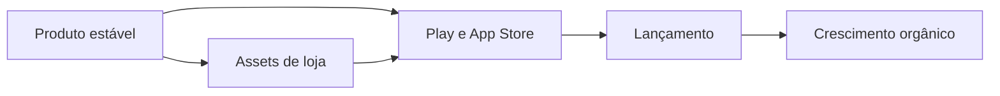

# Plano: atualização de docs e roadmap de lançamento (mínimo esforço)

## Objetivo

Atualizar a documentação para refletir o estado atual do produto e criar um roadmap pragmático de lançamento para **Google Play + App Store**, com foco em:

- esforço mínimo,
- risco baixo de rejeição,
- monetização inicial por **pagamento único sem anúncios**,
- aquisição orgânica antes de mídia paga.

## Arquivos a atualizar/criar

- Atualizar `[README.md](c:/Users/User/projetos/fitlocal/README.md)`
- Atualizar `[docs/google-play-console-checklist.md](c:/Users/User/projetos/fitlocal/docs/google-play-console-checklist.md)`
- Atualizar `[docs/apple-readiness-checklist.md](c:/Users/User/projetos/fitlocal/docs/apple-readiness-checklist.md)`
- Atualizar `[docs/app-review-notes-template.md](c:/Users/User/projetos/fitlocal/docs/app-review-notes-template.md)`
- Criar `[docs/launch-roadmap.md](c:/Users/User/projetos/fitlocal/docs/launch-roadmap.md)`
- (Opcional) Criar `[docs/store-assets-checklist.md](c:/Users/User/projetos/fitlocal/docs/store-assets-checklist.md)` para separar tarefas operacionais de arte/metadata

---

## Fase 1 — Atualização da documentação técnica (estado real)

### 1. README (visão executiva)

Incluir seções curtas e práticas:

- O que o app faz hoje (offline local-first, i18n, treino, progresso, timer, fotos)
- Como rodar localmente (`npm install`, `.env.local`, `npm run dev`, `npm run build`)
- Onde ficam dados (localStorage + IndexedDB)
- Limitações atuais (ex.: sem backend de push remoto; recursos nativos dependem wrapper)
- Links para checklists de loja em `docs/`

### 2. Play checklist

Ajustar para estado atual e pendências concretas:

- Data safety (texto alinhado com comportamento real)
- Conteúdo de saúde e promessas (evitar claims médicos)
- Permissões realmente usadas
- Pré-lançamento interno e smoke tests
- Campos obrigatórios de listing

### 3. Apple checklist

Transformar em checklist de submissão real:

- App completeness
- Privacy labels coerentes
- App Review Notes prontos
- Testes em dispositivo físico
- Critérios de rollback e hotfix

### 4. App review notes template

Atualizar com fluxo real atual:

- Onboarding
- Navegação por tabs
- Timer e preferências
- Delete all data
- Privacidade e armazenamento

---

## Fase 2 — Roadmap de lançamento (documento novo)

Criar `docs/launch-roadmap.md` com 3 trilhos paralelos:

### Trilho A — Go-to-store (o mínimo para publicar)

Checklist objetivo:

- Build release validada
- Política de privacidade pública final
- Ícones e screenshots
- Descrição curta/longa em PT-BR e EN
- Categoria, classificação etária, contato de suporte
- Testes reais em Android e iPhone

### Trilho B — Assets de loja (resposta direta: “preciso prints?”)

Sim, você precisa preparar assets mínimos:

- **Google Play**: ícone 512, feature graphic, screenshots por tamanho obrigatório
- **App Store**: screenshots por device class (iPhone 6.7" e 6.1" já cobrem boa parte), ícone 1024
- 1 vídeo curto é opcional no início

### Trilho C — Qualidade pré-lançamento (sem overengineering)

- Smoke test de 20 minutos por plataforma
- Teste de persistência offline
- Teste de i18n completo (menu + telas + toasts)
- Teste de performance básica (tempo de abertura, travamentos)

---

## Fase 3 — Monetização e crescimento (MVP comercial)

## Recomendação para sua estratégia atual

Como você quer **pagamento único sem anúncios**:

- Não incluir ads no MVP (aumenta complexidade e pode piorar retenção inicial)
- Vender proposta premium simples: privacidade local + treino guiado + progresso
- Avaliar assinatura só após prova de retenção (D30)

### Decisão sobre Twitter e Google Ads

- **Twitter/X**: sim, criar perfil ajuda prova social e canal de updates/suporte
- **Google Ads**: adiar até ter funil mínimo medido (instalação -> onboarding -> 7 dias ativos)
- Priorizar aquisição orgânica inicial:
  - 10-20 vídeos curtos (reels/tiktok/shorts)
  - ASO básico (título, subtítulo, keywords, screenshots)
  - página simples com CTA para stores

### Métricas mínimas (sem stack complexa)

Definir metas e medir manualmente nas primeiras semanas:

- Conversão store -> instalação
- Instalação -> onboarding concluído
- Retenção D1 / D7
- % usuários que registram peso e usam treino
- avaliações e notas

---

## Fase 4 — Plano de execução em 4 semanas (baixo esforço)

### Semana 1

- Atualizar docs e checklists
- Fechar assets e copy de loja
- Preparar build interna

### Semana 2

- TestFlight + Internal Testing Play
- Corrigir bugs críticos
- Finalizar metadata

### Semana 3

- Submeter para review nas duas lojas
- Preparar conteúdo de lançamento (posts e landing)

### Semana 4

- Lançamento gradual
- Coletar feedback e reviews
- Sprint de melhorias rápidas

---

## Critérios de pronto para lançamento

- Checklist Play e Apple sem blockers
- Fluxos críticos sem crash
- Política de privacidade alinhada ao comportamento real
- Assets completos por loja
- Plano de suporte pós-lançamento definido (SLA simples de resposta)

---

## Escopo fora desta rodada (evitar dispersão)

- Ads e SDK de monetização por anúncio
- Sistema avançado de CRM/push com backend
- Features pesadas nativas (widgets completos) antes de validar tração

Esse recorte mantém foco em publicar rápido, reduzir risco e começar a aprender com usuários reais.