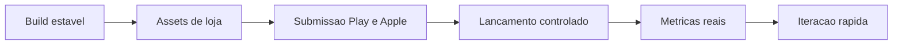

# Launch Roadmap (minimo esforco) - FitLocal

Objetivo: publicar em Google Play + App Store com risco baixo, validando tracao real antes de aumentar complexidade.

Premissas definidas:
- Distribuicao prioritaria: Play + App Store.
- Monetizacao MVP: pagamento unico, sem anuncios.

## Estrategia simples e eficaz

1. Publicar rapido com qualidade suficiente.
2. Medir comportamento real (retencao e uso dos fluxos centrais).
3. Melhorar com base em dados, nao por intuicao.

---

## Fase 0 - Definicao de produto (1 dia)

- ICP inicial: adultos que querem treino e acompanhamento simples com privacidade.
- Posicionamento: "fitness privado no dispositivo, sem friccao".
- Oferta MVP:
  - pagamento unico,
  - sem anuncios,
  - sem paywall complexo.

Decisao: adiar assinatura e adiar ads ate prova de tracao.

---

## Fase 1 - Pronto para lojas (sem overengineering)

## 1.1 Checklist tecnico minimo

- `npm run lint` e `npm run build` sem erro.
- Smoke test em Android e iPhone reais:
  - onboarding,
  - troca de idioma,
  - workout + timer,
  - peso e fotos,
  - delete all data.
- Politica de privacidade atualizada e publicada.

## 1.2 Assets obrigatorios

Sim, voce precisa de screenshots para as lojas.

### Google Play
- App icon 512x512.
- Feature graphic 1024x500.
- Screenshots reais da versao atual.
- Descricao curta e longa.

### App Store
- App icon 1024x1024 (sem alpha).
- Screenshots iPhone 6.7" (obrigatorio).
- Screenshots iPhone 6.1" (recomendado).
- Subtitle e descricao.

## 1.3 Copy de loja (MVP)

- Beneficio principal em 1 frase.
- 3 bullets de valor:
  - treino pratico,
  - progresso visual,
  - privacidade local.
- Evitar claims medicos.

---

## Fase 2 - Submissao e lancamento (sem ansiedade)

## 2.1 Google Play

- Internal testing primeiro.
- Corrigir bugs criticos.
- Producao com rollout gradual (ex.: 10%).

## 2.2 App Store

- TestFlight com testers internos.
- Submissao com App Review Notes bem preenchido.
- Liberacao apos aprovacoes.

## 2.3 Operacao das primeiras 72h

- Monitorar reviews e crash reports.
- Responder reviews com educacao e rapidez.
- Hotfix apenas para bug que quebra fluxo central.

---

## Fase 3 - Growth inicial (baixo custo)

## 3.1 Canais recomendados no inicio

- Criar perfil no X/Twitter: sim, vale a pena para update publico e prova social.
- Reels/TikTok/Shorts: 10-20 videos curtos mostrando uso real.
- Landing page simples com CTA para lojas.

## 3.2 O que NAO fazer no inicio

- Nao rodar Google Ads antes de validar funil basico.
- Nao abrir muitos canais ao mesmo tempo.
- Nao adicionar ads no app antes de validar retencao.

## 3.3 Metricas minimas para decidir proximo passo

- Store view -> install.
- Install -> onboarding concluido.
- Retencao D1 e D7.
- % usuarios que usam workout e logam peso.
- Nota media e volume de reviews.

Regra pratica:
- Se D7 estiver fraco, corrigir onboarding/valor percebido antes de pagar aquisicao.

---

## Fase 4 - Monetizacao (pagamento unico sem anuncios)

Recomendacao para seu contexto:
- Comecar com pagamento unico.
- Sem anuncios no MVP (experiencia melhor e menos complexidade legal/tecnica).
- Revisar preco com base em:
  - conversao de compra,
  - reembolso,
  - retencao.

Quando considerar assinatura:
- somente apos validar uso recorrente real (ex.: D30 e uso semanal consistente).

---

## Plano de 4 semanas

## Semana 1
- Fechar docs, checklists e copy de loja.
- Preparar screenshots finais.
- Build interna e smoke test completo.

## Semana 2
- TestFlight + Internal Testing Play.
- Corrigir bugs criticos.
- Finalizar metadata de loja.

## Semana 3
- Submissao em ambas lojas.
- Preparar conteudo de lancamento (posts + landing).

## Semana 4
- Lancamento gradual.
- Monitorar metricas.
- Sprint de melhorias rapidas.

---

## Backlog de alto valor e baixo esforco (pos-launch)

- Melhorar onboarding com foco em "time to first value".
- Pequenos ajustes de i18n e copy com base em reviews.
- Checklist de QA automatizado para regressao dos fluxos principais.
- Melhorias de notificacao e imersao somente se aumentarem retencao.

---

## Checklist rapido (go/no-go)

- [ ] Sem crash em fluxo principal.
- [ ] Politica de privacidade publicada e coerente.
- [ ] Assets completos por loja.
- [ ] App Review Notes prontas.
- [ ] Time preparado para responder feedback em 24-48h.

Se tudo acima estiver OK, publicar.
